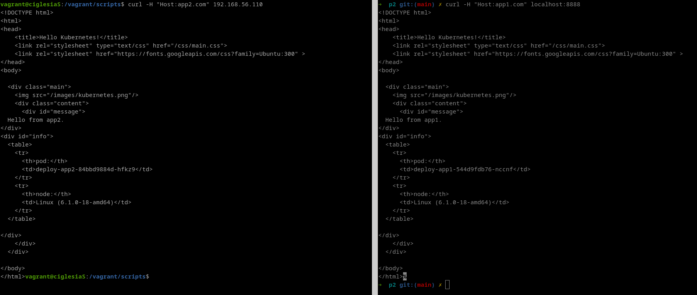
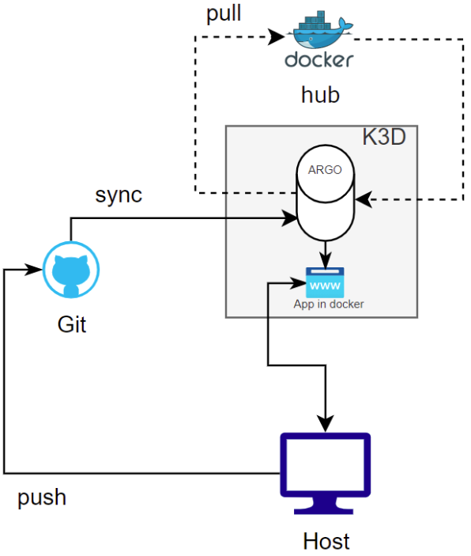
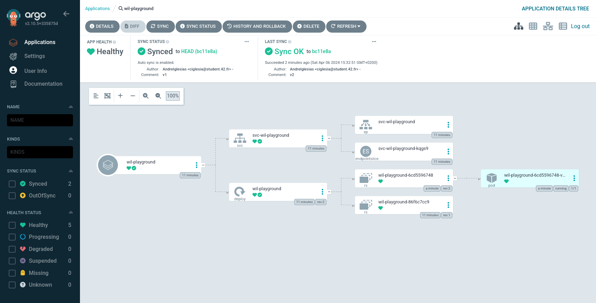

# Inception-of-Things

This comprehensive project is designed to guide developers through the setup of a virtual environment for Kubernetes deployment using Vagrant, deploying K3s, understanding its Ingress feature, simplifying Kubernetes management with K3d, and implementing CD for working clusters in Docker. Whether you're a seasoned developer or just starting with Kubernetes, this project provides hands-on experience and improves your CD skills.

## Prerequisites
- [Vagrant](https://www.vagrantup.com/)
- [VirtualBox](https://www.virtualbox.org/)

## Part 1: Setting up a K3s cluster with Vagrant

### Overview
In this section, we'll create a Kubernetes cluster using K3s on virtual machines provisioned by Vagrant.

<p align="center">  
   
</p>

### Step-by-Step Guide
1. Clone this repository.
2. Run `vagrant up` in the project directory to create two VMs: `ciglesiaS` and `ciglesiaSW` with dedicated IPs.
3. SSH into "ciglesiaS" VM using `vagrant ssh ciglesiaS`.
4. Use `kubectl` commands to interact with the cluster.

## Part 2: K3s and Three Simple Applications

### Overview
This part focuses on running three simple web applications within a K3s instance on a single virtual machine.

<p align="center">  
   
</p>

### Accessing Applications
Depending on the host used when making a request to IP address 192.168.56.110, different applications will be displayed.

### Manifests and Configuration
1. Deployment: Manages Pods and ReplicaSets, ensuring the desired number of pod replicas.
2. Services: Acts as a stable network interface to a dynamic set of Pods.
3. Ingress: Routes external HTTP traffic to internal Services.

The host determines which application will be accessed.

```bash
# From the host of the vm
curl -H "Host:app1.com" localhost:8888
curl -H "Host:app1.com" 192.168.56.110
# From inside the vm
curl -H "Host:app1.com" localhost
```

That will output:
```html
<!DOCTYPE html>
<html>
<head>
    <title>Hello Kubernetes!</title>
    <link rel="stylesheet" type="text/css" href="/css/main.css">
    <link rel="stylesheet" href="https://fonts.googleapis.com/css?family=Ubuntu:300" >
</head>
<body>

  <div class="main">
    
    <div class="content">
      <div id="message">
  Hello from app1.
</div>
<div id="info">
  <table>
    <tr>
      <th>pod:</th>
      <td>deploy-app1-544d9fdb76-nzn2z</td>
    </tr>
    <tr>
      <th>node:</th>
      <td>Linux (6.1.0-18-amd64)</td>
    </tr>
  </table>

</div>
    </div>
  </div>

</body>
</html>
```

<p align="center">  
   
</p>

## Part 3: K3d and Argo CD

### Overview
Part 3 involves setting up a k3d cluster on a virtual machine without using Vagrant. Continuous integration is implemented using Argo CD to deploy and update an application from a public GitHub repository.

<p align="center">  
   
</p>

### Steps to Follow
1. Run the `k3d.sh` script to install and set up the k3d cluster.
2. Execute the `argocd.sh` script to set up ArgoCD and the application in Docker.

The ArgoCD service runs on port `8443`, and the application (accessible via Kubernetes service) runs on port `8888`.

To verify which version the server is currently running, use:
```bash
curl http://localhost:8888
# This should return:
{"status":"ok", "message": "v2"}
```

You can access the ArgoCD web interface by browsing to `http://localhost:8443`, which automates the synchronization of the containerized app version with the manifest found at [deploy.yaml](https://github.com/AndreIglesias/ciglesia/blob/main/manifests/deploy.yaml).

<p align="center">  
   
</p>

---

For more details, check out the respective parts in the repository: [Inception-of-Things](https://github.com/AndreIglesias/Inception-of-Things).
