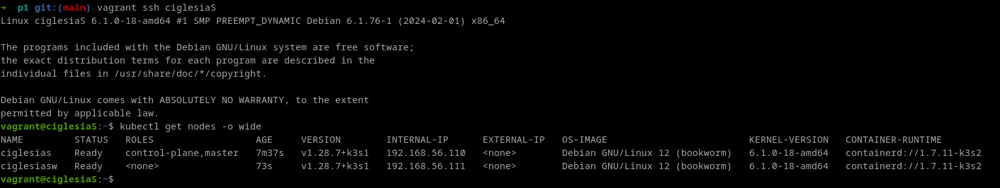

# Vagrant

> [!NOTE]
> Vagrant is the command line utility for managing the lifecycle of virtual machines. Isolate dependencies and their configuration within a single disposable and consistent environment.

To create the `Vagrantfile`, we need to search the desired *box* to install: [debian boxes](https://app.vagrantup.com/debian).

After choosing the desired box, we proceed to initialize the vagrant project:

```bash
vagrant init debian/bookworm64
```

Then to start the vagrant VM, we can run it with: 

```bash
vagrant up
# To test it is working, we can ssh into the vm
vagrant ssh ciglesiaS
vagrant ssh ciglesiaSW
vagrant global-status
```

To make the changes effective while the vm is already up, we can use:

```bash
vagrant reload --provision
```

To destroy the virtual machines
```bash
vagrant destroy -f
```

# K3S

> [!NOTE]
> [K3s](https://k3s.io/) is a lightweight Kubernetes distribution designed for resource-constrained environments.

The server is configured in controller mode.
The server worker is configured in agent mode.


Simple **server** and **Agent** setup:
```bash
sudo k3s server &
# Kubeconfig is written to /etc/rancher/k3s/k3s.yaml
sudo k3s kubectl get node

# On a different node run the below command. 
# NODE_TOKEN comes from /var/lib/rancher/k3s/server/node-token on your server
sudo k3s agent --server https://myserver:6443 --token ${NODE_TOKEN}
```

On the master server, we can check the K3s server API with:sudo k3s 
```bash
kubectl cluster-info
```

# Nodes

```bash
kubectl get nodes -o wide
```

