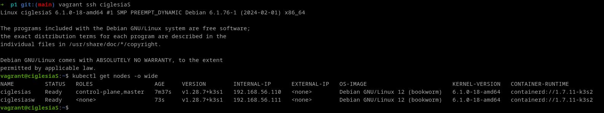

# Steps to test

- Run the virtual machines:
`vagrant up`

- Connect ssh to server master:
`vagrant ssh ciglesiaS`

 - Verify ip addres:
 `ip addr | grep eth1`

 - Check the cluster:
 `kubectl get nodes -o wide`


# Vagrant

> [!NOTE]
> Vagrant is the command line utility for managing the lifecycle of virtual machines. Isolate dependencies and their configuration within a single disposable and consistent environment.

Vagrant is a way to automate the creation and configuration of one or more virtual machine of virtualization products such as; VirtualBox, VMware Fusion, or Hyper-V.

The vagrant file where we describe our desired configuration is called a `Vagrantfile`.

We want to install the latest debian, so we need to search our desired *box* to install here: [debian boxes](https://app.vagrantup.com/debian).

After choosing the desired box, we proceed to initialize the vagrant project:

```bash
vagrant init debian/bookworm64
```

Then to start the vagrant VM, we can run it with: 

```bash
vagrant up
# To test it is working, we can ssh into the vm
vagrant ssh ciglesiaS
# ssh root@192.168.56.110
vagrant ssh ciglesiaSW
# ssh root@192.168.56.111
vagrant global-status
```

To make the changes effective, each time we modify our vagrant file while the vm is already up, we can use:

```bash
vagrant reload --provision
```

To destroy the virtual machines
```bash
vagrant destroy # -f (if not want to ask [y/N] for each machine)
```

# K3S

> [!NOTE]
> [K3s](https://k3s.io/) is a lightweight Kubernetes distribution designed for resource-constrained environments.

K3s is like a mini-version of Kubernetes, the popular system for managing containerized applications. It's designed to work on computers or devices with limited resources, like laptops, IoT gadgets, or edge computing devices.

> [!NOTE]
> When you have a lot of different programs you want to run on your computer or a group of computers. Now, these programs might need different resources, like memory or processing power, and they might need to talk to each other. Managing all of this manually can get really complicated.
>
> Here's where Kubernetes (or K8s for short) comes in. It's like having a smart manager for your programs. Instead of you having to keep track of everything, Kubernetes does it for you. It makes sure each program gets what it needs to run smoothly and helps them communicate with each other.

> The server is configured in controller mode.
> The server worker is configured in agent mode.


Simple **server** and **Agent** setup:
```bash
sudo k3s server &
# Kubeconfig is written to /etc/rancher/k3s/k3s.yaml
sudo k3s kubectl get node

# On a different node run the below command. 
# NODE_TOKEN comes from /var/lib/rancher/k3s/server/node-token on your server
sudo k3s agent --server https://myserver:6443 --token ${NODE_TOKEN}
```

On the master server, we can check the K3s server API with:sudo k3s 
```bash
kubectl cluster-info
```

# Nodes

```bash
kubectl get nodes -o wide
```



| Concept               | Description                                                                                                                                                     | Example                                                                                                                                                                  |
|-----------------------|-----------------------------------------------------------------------------------------------------------------------------------------------------------------|--------------------------------------------------------------------------------------------------------------------------------------------------------------------------|
| Cluster               | A collection of physical or virtual machines (nodes) grouped together to run containerized applications orchestrated by Kubernetes.                              | A Kubernetes cluster consists of one or more master nodes and multiple worker nodes, collectively managing and executing containerized applications.                     |
| Master Node           | Manages the Kubernetes cluster, including the control plane components such as API server, scheduler, controller manager, and etcd.                             | A cluster may have one or more master nodes responsible for coordinating the cluster's operations.                                                                      |
| Worker Nodes          | Hosts containerized applications (pods) and runs the Kubernetes runtime environment.                                                                             | A cluster typically has multiple worker nodes where the actual application containers are deployed and executed.                                                         |
| Pods                  | Smallest deployable unit in Kubernetes, encapsulating one or more containers and shared resources.                                                              | An example pod may consist of a frontend container and a backend container, both serving a web application.                                                              |
| ReplicaSets           | Ensures a specified number of pod replicas are running at any given time, maintaining desired pod replicas by creating or deleting pods as needed.                 | A ReplicaSet may ensure that three replicas of a web server pod are running to handle incoming traffic.                                                                  |
| Services              | Provides a consistent way to access a set of pods, defining a logical set of pods and policies for accessing them.                                               | A service may expose a set of pods as a single, stable endpoint, allowing clients to access the pods without needing to know their individual IP addresses.           |
| Labels and Selectors | Key-value pairs attached to Kubernetes objects, used for grouping and selecting objects within Kubernetes.                                                     | Pods may be labeled with "app=frontend" and "env=production", allowing selectors to identify all pods with these labels for certain operations.                       |
| Namespaces            | Logically partitions resources within a cluster, useful for organizing and isolating objects and resources.                                                     | Namespaces can be used to isolate resources for different teams or projects within a cluster, ensuring resource and access separation.                                   |
| Persistent Volumes    | Provides persistent storage for stateful applications, representing physical storage resources, and requested by pods through Persistent Volume Claims.        | A Persistent Volume may represent a network-attached storage volume, and a Persistent Volume Claim can request storage of a certain size and access mode for a pod. |


### Vagrant
```bash
    vagrant init: Initialize the Vagrantfile.
    vagrant up: Raise virtual machines.
    vagrant destroy: Destroy virtual machines.
    vagrant status: Show the current status of virtual machines.
    vagrant global status: Show the status of active virtual machines.
    vagrant validate: Check the validity of Vagrantfile.
    vagrant ssh <machine name>: Connect to the machine via ssh.
    vagrant suspend: Suspend the virtual machine.
    vagrant resume: Resume a suspended virtual machine.
    vagrant halt: Halt the running virtual machine.
    vagrant reload: Reload the Vagrantfile and restart the virtual machine.
    vagrant provision: Run the provisioning scripts on a running virtual machine.
```
### Kubectl
```bash
    kubectl get all -n [namespace-name]: View all resources in a specific namespace.
    kubectl get all --all-namespaces: View all resources in all namespaces.
    kubectl get [pod, ingress, or another Kubernetes resource] -n [namespace-name] -o yaml: Show YAML manifest information about a specific Kubernetes resource in some namespace.
    kubectl describe [pod, ingress, or another essence of k8s] -n [namespace-name]: Show detailed information about a specific Kubernetes resource in some namespace.
    kubectl exec -it [pod-name] -- /bin/sh: Access the Pod.
    kubectl apply -f [file.yaml]: Apply configuration from a YAML file.
    kubectl delete [resource-name]: Delete a Kubernetes resource.
    kubectl edit [resource-type] [resource-name]: Edit a Kubernetes resource in a text editor.
    kubectl rollout restart deployment [deployment-name]: Restart a deployment.
```
