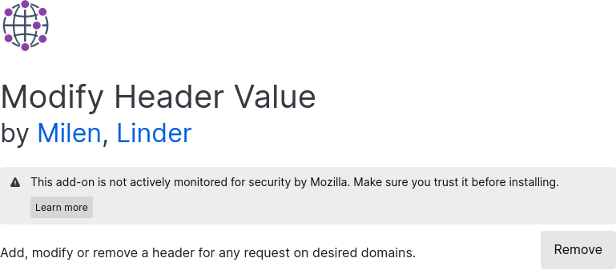
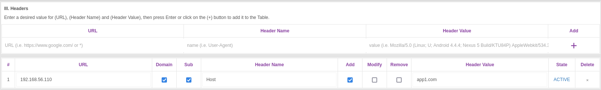
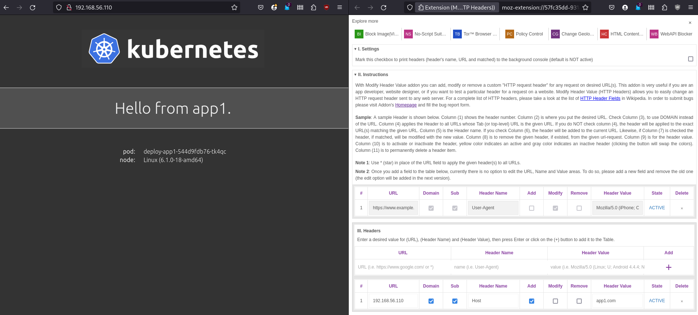
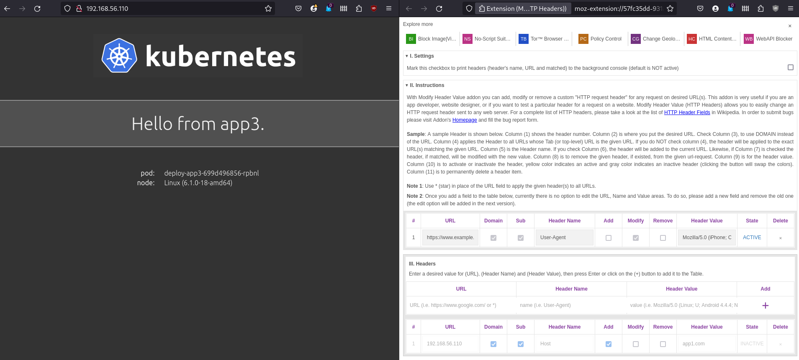

# P2
## Run the vm for the first time

```bash
vagrant up
```

## Acces the vm

```bash
vagrant ssh jiglesiaS
```

## Exit vm

```bash
exit
```

## App from host machine

### With curl

Access the applications using curl from the host machine.

```bash
curl -H 'Host:app1.com' 192.168.56.110
```
This will output the app html
```html
<!DOCTYPE html>
<html>
<head>
    <title>Hello Kubernetes!</title>
    <link rel="stylesheet" type="text/css" href="/css/main.css">
    <link rel="stylesheet" href="https://fonts.googleapis.com/css?family=Ubuntu:300" >
</head>
<body>

  <div class="main">
    
    <div class="content">
      <div id="message">
  Hello from app1.
</div>
<div id="info">
  <table>
    <tr>
      <th>pod:</th>
      <td>deploy-app1-544d9fdb76-mch6r</td>
    </tr>
    <tr>
      <th>node:</th>
      <td>Linux (6.1.0-18-amd64)</td>
    </tr>
  </table>

</div>
    </div>
  </div>

</body>
</html>
```

### With browser

Install the "Modify Header Value" add-on in your browser.



Set up the header for the IP.



Access the applications from the host machine:



Accessing app2:


Accessing app3:


