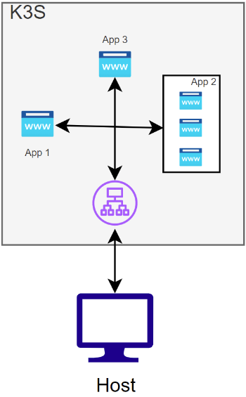

# Vagrant

> [!NOTE]
> Vagrant is the command line utility for managing the lifecycle of virtual machines. Isolate dependencies and their configuration within a single disposable and consistent environment.

Vagrant is a way to automate the creation and configuration of one or more virtual machine of virtualization products such as; VirtualBox, VMware Fusion, or Hyper-V.

The vagrant file where we describe our desired configuration is called a `Vagrantfile`.

We want to install the latest debian, so we need to search our desired *box* to install here: [debian boxes](https://app.vagrantup.com/debian).

After choosing the desired box, we proceed to initialize the vagrant project:

```bash
vagrant init debian/bookworm64
```

Then to start the vagrant VM, we can run it with: 

```bash
vagrant up
# To test it is working, we can ssh into the vm
vagrant ssh jiglesiaS
# ssh root@192.168.56.110
vagrant global-status
```

To make the changes effective, each time we modify our vagrant file while the vm is already up, we can use:

```bash
vagrant reload --provision
```

To destroy the virtual machines
```bash
vagrant destroy # -f (if not want to ask [y/N] for each machine)
```

# K3S

> [!NOTE]
> [K3s](https://k3s.io/) is a lightweight Kubernetes distribution designed for resource-constrained environments.

K3s is like a mini-version of Kubernetes, the popular system for managing containerized applications. It's designed to work on computers or devices with limited resources, like laptops, IoT gadgets, or edge computing devices.

> [!NOTE]
> When you have a lot of different programs you want to run on your computer or a group of computers. Now, these programs might need different resources, like memory or processing power, and they might need to talk to each other. Managing all of this manually can get really complicated.
>
> Here's where Kubernetes (or K8s for short) comes in. It's like having a smart manager for your programs. Instead of you having to keep track of everything, Kubernetes does it for you. It makes sure each program gets what it needs to run smoothly and helps them communicate with each other.

> The server is configured in controller mode.
> The server worker is configured in agent mode.


Simple **server** and **Agent** setup:
```bash
sudo k3s server &
# Kubeconfig is written to /etc/rancher/k3s/k3s.yaml
sudo k3s kubectl get node

# On a different node run the below command. 
# NODE_TOKEN comes from /var/lib/rancher/k3s/server/node-token on your server
sudo k3s agent --server https://myserver:6443 --token ${NODE_TOKEN}
```

On the master server, we can check the K3s server API with:sudo k3s 
```bash
kubectl cluster-info
```

# Nodes

```bash
kubectl get nodes -o wide
```

