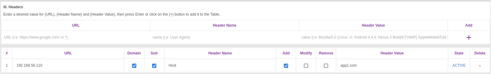

# Run the vm for the first time

`vagrant up`

# Acces the vm

`vagrant ssh jiglesiaS`

# Exit vm

`exit`

# Acces the applications using curl

`curl -H 'Host:app3.com' 192.168.56.110`

# Acces using browser

Install add-on "Modify Header Value"

Set up the header for the ip

