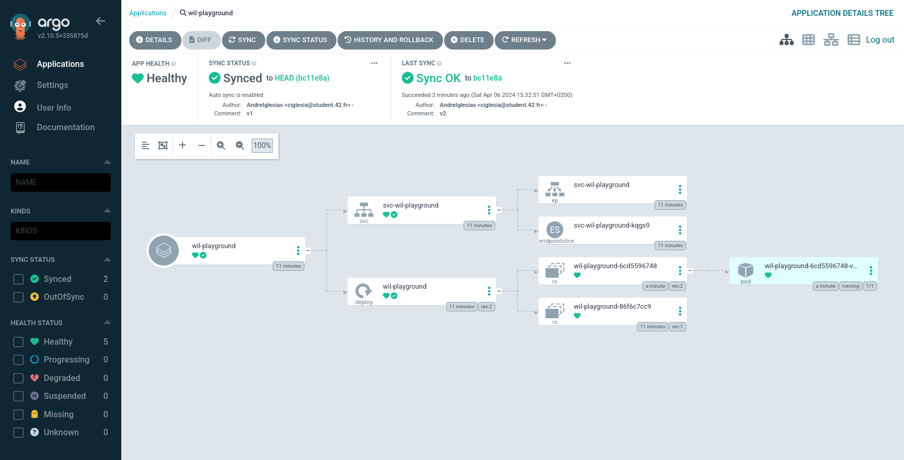

# P3

## How to test

Run the application:
```
vagrant up
```

Acces on browser to argo:
```
localhost:8443
```


user:
`admin`

password:
`can be found when compiled, under "🔑 Getting the ArgoCD password..."`


You can choose "wil-playground" app



Access on browser to application:

```
http://localhost:8888
```

You can check out the version


Access the app with curl:
```bash
curl localhost:8888
```

```bash
# This should return:
{"status":"ok", "message": "v2"}
```

To change the version of the app you have to clone and modify the manifest here:
`https://github.com/AndreIglesias/ciglesia`

### Difference between K3S and K3D

| Feature            | K3s                                           | K3d                                                   |
|--------------------|-----------------------------------------------|-------------------------------------------------------|
| Purpose            | Lightweight Kubernetes distribution          | Tool for running K3s clusters within Docker containers |
| Deployment         | Suitable for production and resource-constrained environments | Primarily for local development and testing      |
| Resource Usage     | Optimized for minimal resource consumption   | Uses Docker containers for isolation                              |
| Deployment Method  | Typically deployed directly on machines or VMs | Runs K3s clusters within Docker containers                      |
| Use Cases          | Edge computing, IoT, CI/CD pipelines         | Local development, testing, prototyping                           |
| Dependencies       | Minimal dependencies; often deployed with a single binary | Requires Docker for containerization                 |
| Ease of Management | Simplified deployment and management          | Easily create and manage multiple local clusters                 |
| Scalability        | Suitable for scaling in resource-constrained environments | Primarily used for local development, not for large-scale production |


## ArgoCD

The server within the VM because it binds to 127.0.0.1, which is loopback.
You'll want to make sure that the server is bound to 0.0.0.0 so that all interfaces can access it.
